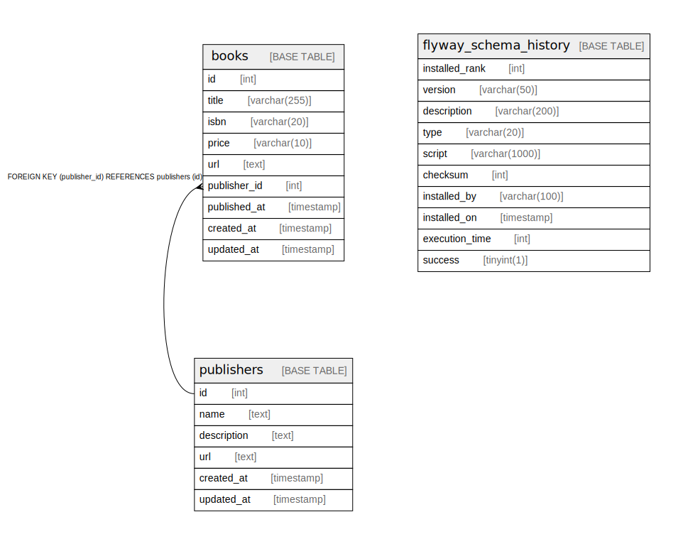

# tech_books_explorer

## Tables

| Name | Columns | Comment | Type |
| ---- | ------- | ------- | ---- |
| [books](books.md) | 9 |  | BASE TABLE |
| [flyway_schema_history](flyway_schema_history.md) | 10 |  | BASE TABLE |
| [publishers](publishers.md) | 6 |  | BASE TABLE |

## Relations

---

> Generated by [tbls](https://github.com/k1LoW/tbls)
