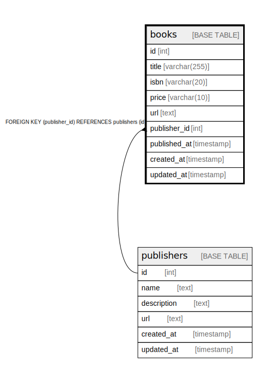

# books

## Description

<details>
<summary><strong>Table Definition</strong></summary>

```sql
CREATE TABLE `books` (
  `id` int NOT NULL AUTO_INCREMENT,
  `title` varchar(255) NOT NULL COMMENT '技術書タイトル',
  `isbn` varchar(20) NOT NULL COMMENT 'ISBN',
  `price` varchar(10) DEFAULT NULL COMMENT '価格',
  `url` text NOT NULL COMMENT '技術書ページのURL',
  `publisher_id` int NOT NULL COMMENT '出版社ID',
  `published_at` timestamp NOT NULL COMMENT '出版日',
  `created_at` timestamp NOT NULL DEFAULT CURRENT_TIMESTAMP,
  `updated_at` timestamp NOT NULL DEFAULT CURRENT_TIMESTAMP ON UPDATE CURRENT_TIMESTAMP,
  PRIMARY KEY (`id`),
  UNIQUE KEY `isbn` (`isbn`),
  KEY `title` (`title`),
  KEY `publisher_id` (`publisher_id`),
  CONSTRAINT `books_ibfk_1` FOREIGN KEY (`publisher_id`) REFERENCES `publishers` (`id`)
) ENGINE=InnoDB DEFAULT CHARSET=utf8mb4 COLLATE=utf8mb4_0900_ai_ci
```

</details>

## Columns

| Name | Type | Default | Nullable | Extra Definition | Children | Parents | Comment |
| ---- | ---- | ------- | -------- | ---------------- | -------- | ------- | ------- |
| id | int |  | false | auto_increment |  |  |  |
| title | varchar(255) |  | false |  |  |  | 技術書タイトル |
| isbn | varchar(20) |  | false |  |  |  | ISBN |
| price | varchar(10) |  | true |  |  |  | 価格 |
| url | text |  | false |  |  |  | 技術書ページのURL |
| publisher_id | int |  | false |  |  | [publishers](publishers.md) | 出版社ID |
| published_at | timestamp |  | false |  |  |  | 出版日 |
| created_at | timestamp | CURRENT_TIMESTAMP | false | DEFAULT_GENERATED |  |  |  |
| updated_at | timestamp | CURRENT_TIMESTAMP | false | DEFAULT_GENERATED on update CURRENT_TIMESTAMP |  |  |  |

## Constraints

| Name | Type | Definition |
| ---- | ---- | ---------- |
| books_ibfk_1 | FOREIGN KEY | FOREIGN KEY (publisher_id) REFERENCES publishers (id) |
| isbn | UNIQUE | UNIQUE KEY isbn (isbn) |
| PRIMARY | PRIMARY KEY | PRIMARY KEY (id) |

## Indexes

| Name | Definition |
| ---- | ---------- |
| publisher_id | KEY publisher_id (publisher_id) USING BTREE |
| title | KEY title (title) USING BTREE |
| PRIMARY | PRIMARY KEY (id) USING BTREE |
| isbn | UNIQUE KEY isbn (isbn) USING BTREE |

## Relations



---

> Generated by [tbls](https://github.com/k1LoW/tbls)
