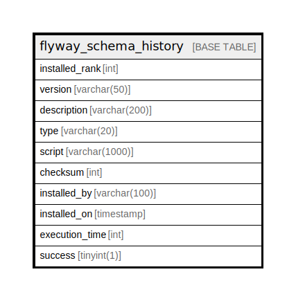

# flyway_schema_history

## Description

<details>
<summary><strong>Table Definition</strong></summary>

```sql
CREATE TABLE `flyway_schema_history` (
  `installed_rank` int NOT NULL,
  `version` varchar(50) DEFAULT NULL,
  `description` varchar(200) NOT NULL,
  `type` varchar(20) NOT NULL,
  `script` varchar(1000) NOT NULL,
  `checksum` int DEFAULT NULL,
  `installed_by` varchar(100) NOT NULL,
  `installed_on` timestamp NOT NULL DEFAULT CURRENT_TIMESTAMP,
  `execution_time` int NOT NULL,
  `success` tinyint(1) NOT NULL,
  PRIMARY KEY (`installed_rank`),
  KEY `flyway_schema_history_s_idx` (`success`)
) ENGINE=InnoDB DEFAULT CHARSET=utf8mb4 COLLATE=utf8mb4_0900_ai_ci
```

</details>

## Columns

| Name | Type | Default | Nullable | Extra Definition | Children | Parents | Comment |
| ---- | ---- | ------- | -------- | ---------------- | -------- | ------- | ------- |
| installed_rank | int |  | false |  |  |  |  |
| version | varchar(50) |  | true |  |  |  |  |
| description | varchar(200) |  | false |  |  |  |  |
| type | varchar(20) |  | false |  |  |  |  |
| script | varchar(1000) |  | false |  |  |  |  |
| checksum | int |  | true |  |  |  |  |
| installed_by | varchar(100) |  | false |  |  |  |  |
| installed_on | timestamp | CURRENT_TIMESTAMP | false | DEFAULT_GENERATED |  |  |  |
| execution_time | int |  | false |  |  |  |  |
| success | tinyint(1) |  | false |  |  |  |  |

## Constraints

| Name | Type | Definition |
| ---- | ---- | ---------- |
| PRIMARY | PRIMARY KEY | PRIMARY KEY (installed_rank) |

## Indexes

| Name | Definition |
| ---- | ---------- |
| flyway_schema_history_s_idx | KEY flyway_schema_history_s_idx (success) USING BTREE |
| PRIMARY | PRIMARY KEY (installed_rank) USING BTREE |

## Relations



---

> Generated by [tbls](https://github.com/k1LoW/tbls)
